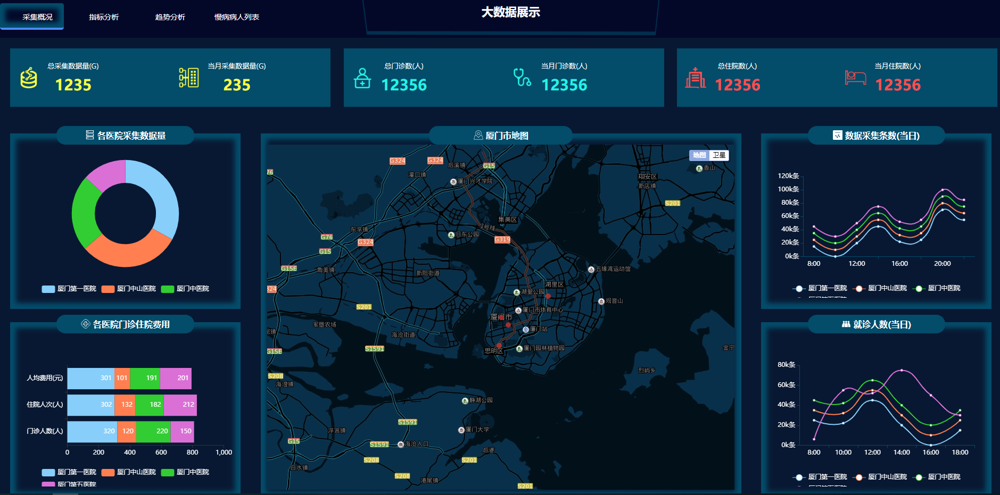
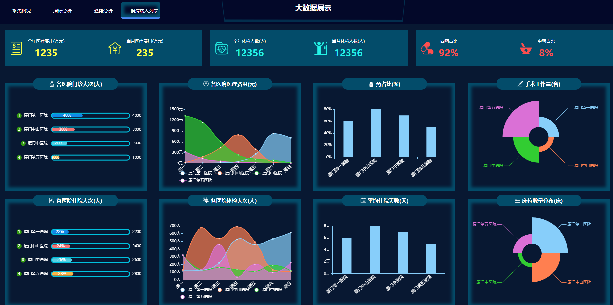
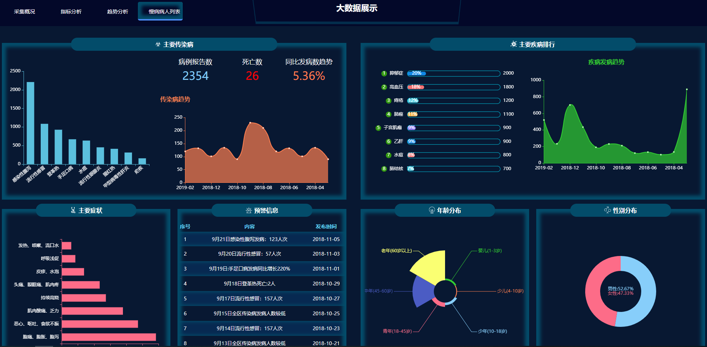
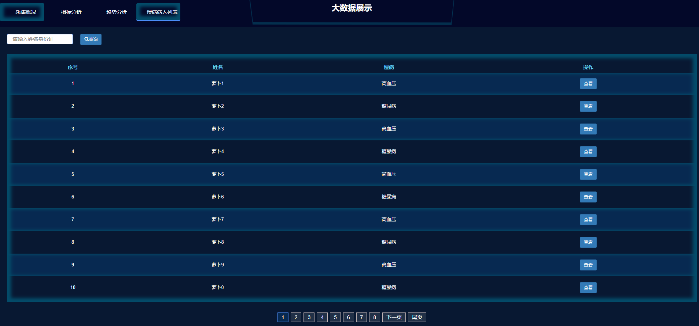

# web模板收集项目

## 1.介绍
本项目主要为保存自己从网上搜集来的一些常用web模板及效果图，方便以后查找

## 2.目录
### 2.1 [医院大数据统计可视化页面模板](https://github.com/chongwangcc/web_templates/tree/master/%E5%8C%BB%E9%99%A2%E5%A4%A7%E6%95%B0%E6%8D%AE%E7%BB%9F%E8%AE%A1%E5%8F%AF%E8%A7%86%E5%8C%96%E9%A1%B5%E9%9D%A2%E6%A8%A1%E6%9D%BF)
效果图

